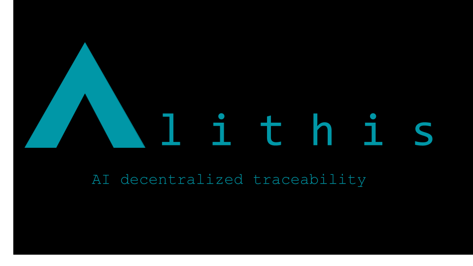

# alithis

## FVM Space Warp Hackathon submission

[ETHGlobal Link](https://ethglobal.com/showcase/alithis-6s995)

[Live Demo](https://alithispage-dcf298.spheron.app/)

[Mnist verification app](https://alithis-mnist.elfx.repl.co/)

**Short description**

Alithis, it's purpose is to promote AI safety and traceability to machine learning models trough the power of blockchain.
We're proposing means to map datasets and models resulting in a comprehensive relation of the data, it's model process, and stores the data persistently.

**Long description**

There is uncertainty nowadays of the origin of data in top of the line machine learning models used in the industry, as a clear example there have been discussions if the diffusion models are 'stealing' from artists.

What if we would like to know where such data was taken from for machine learning models?

Alithis proposes a way of clarifying the black box on AI models by bringing data and model traceability. And how is this done?

It mints an NFT for the dataset and stores a SHA256 hash of each data point. This way we can have a persistent relation of the data and a unique identifier of the data in it (by the SHA256 data), this could also provide privacy for dataset that holds personal or private data, because it does not disclose the data but a transformation that only corresponds to such data point.

When creating a machine learning model, there is lots of metadata and hyper parameters related to fine tuning and optimization that helps it work in the best manner, this information is also minted along with the dataset in an NFT so we can have a way to relate the data to the model.

Alithis is a proof of concept for AI model traceability, it allows to verify the data origin for machine learning models.

**Proof of Concept**

To use this project, run the jupyter notebook, this will download the json files.
These files have to be hosted (on lighthouse) as they hold all the dataset hashes. [Example here](https://gateway.lighthouse.storage/ipfs/QmQxacstpd2WLzJmTa9tk82XPYEZRiV8h6TC4QVhS8iqSk)

After adding this data to the contract on _dataset-model-nft/contracts/datanft.sol_

Then

`npx hardhat run scripts/run.js`

or

`npx hardhat run scripts/deploy.js`
